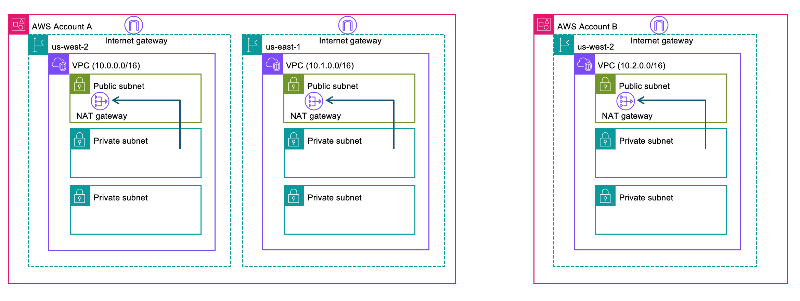

<!-- Copyright Amazon.com, Inc. or its affiliates. All Rights Reserved. -->
<!-- SPDX-License-Identifier: Apache-2.0 -->

# Prerequisites

This folder contains the setup notebook and reference guides needed before running any of the labs.

## Setup Notebook

| Notebook | Description |
|----------|-------------|
| [00-vpc-gateway-setup.ipynb](./00-vpc-gateway-setup.ipynb) | Deploys the foundational infrastructure: VPCs across two regions (us-west-2, us-east-1), bootstraps CDK, and creates the shared AgentCore Gateway with Cognito M2M authentication. All subsequent labs depend on this notebook. |

## Domain and Certificate Guides

AgentCore Gateway VPC egress requires a **publicly trusted TLS certificate** on the target endpoint. Depending on whether your DNS is public or private, different patterns apply. These guides explain each combination:

### Concept Guides

| Guide | Description |
|-------|-------------|
| [Public Certificate + Public Domain](./public-certificate-public-domain.md) | Domain is publicly resolvable (resolves to private IPs). Simplest setup: no `routingDomain` needed. |
| [Public Certificate + Private Domain](./public-certificate-private-domain.md) | Domain resolves only inside the VPC. Uses `routingDomain` to route via the load balancer's publicly resolvable DNS. |
| [Private Certificate + Public Domain](./private-certificate-public-domain.md) | Not directly supported by AgentCore. Workaround: place a load balancer with a public cert in front. |
| [Private Certificate + Private Domain](./private-certificate-private-domain.md) | Not directly supported by AgentCore. Workaround: public cert on load balancer + `routingDomain` for private DNS. |

### How-To Guides

| Guide | Description |
|-------|-------------|
| [Create an ACM Public Certificate](./create-acm-public-certificate.md) | Step-by-step: request, validate via DNS, and verify an ACM public certificate. |
| [Create a Public DNS Record](./create-public-dns-record.md) | Create a CNAME record in a public hosted zone pointing to your internal load balancer. |
| [Create a Private Hosted Zone](./create-private-hosted-zone.md) | Create a Route 53 private hosted zone, add an Alias record to the load balancer, and verify. |

## License

This project is licensed under the Apache License 2.0. See the [LICENSE](../LICENSE.txt) file for details.
