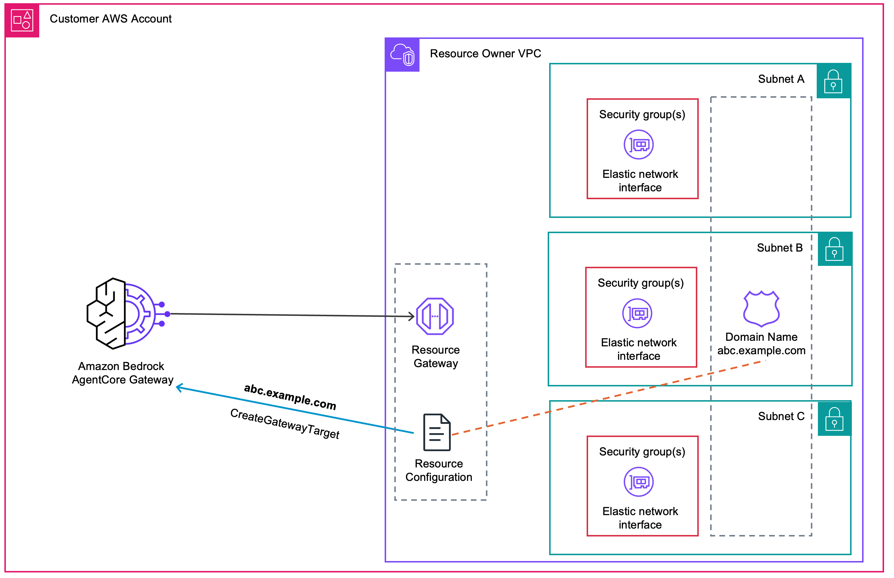
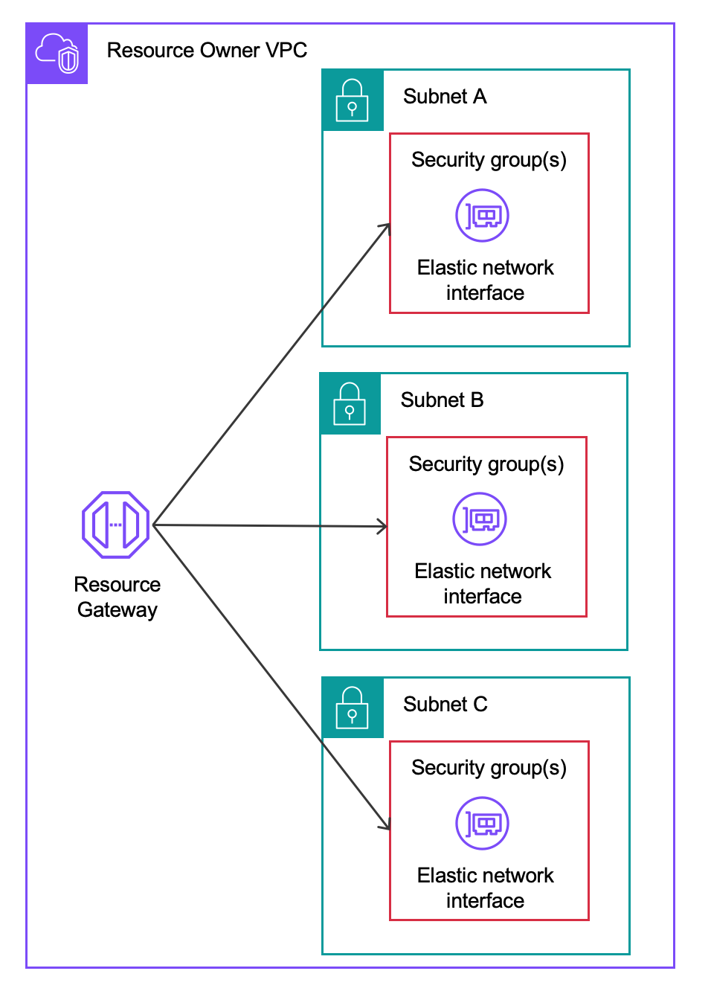
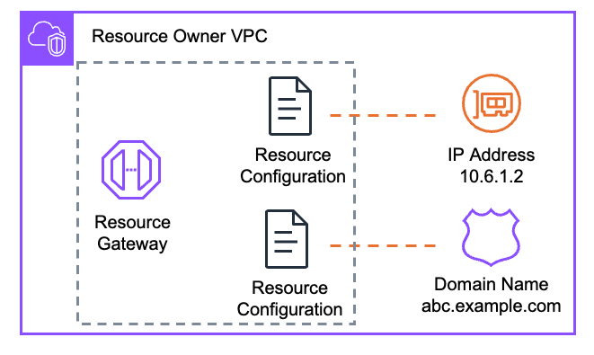
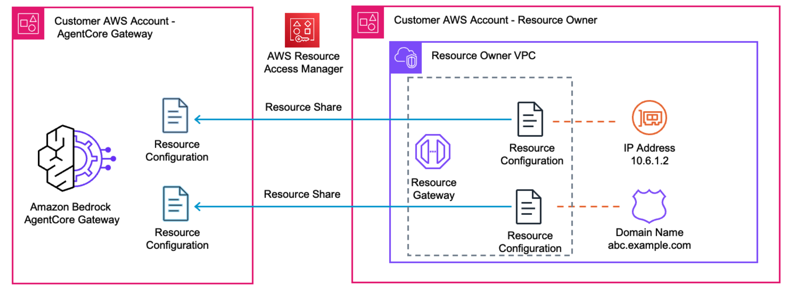
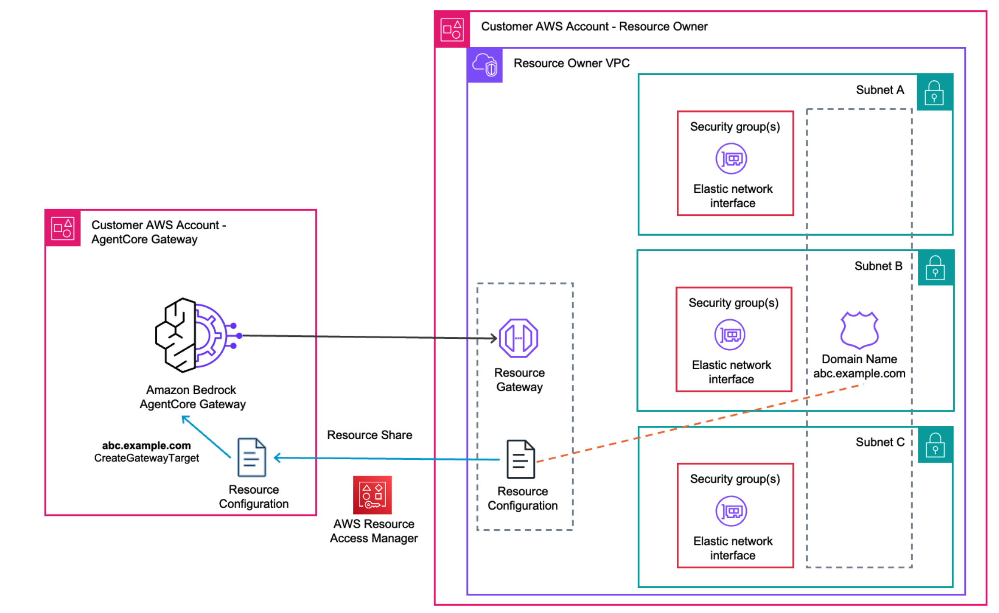

<!-- Copyright Amazon.com, Inc. or its affiliates. All Rights Reserved. -->
<!-- SPDX-License-Identifier: Apache-2.0 -->

# Self-Managed Amazon VPC Lattice

> This feature is made available to you as a "Beta Service" as defined in the [AWS Service Terms](https://aws.amazon.com/service-terms/). It is subject to your Agreement with AWS and the AWS Service Terms.

You create the VPC Lattice resource gateway and resource configuration yourself, then provide the resource configuration identifier to AgentCore. Use this option for cross-account connectivity, if you already have VPC Lattice resources set up, or if you need fine-grained control over the Lattice configuration.



## When to use self-managed Lattice

- You already have VPC Lattice resources configured
- You need **cross-account connectivity** (resource in a different account than the gateway)
- You need to share a resource configuration across multiple gateway targets
- You require control over the Lattice resource lifecycle (e.g., number of IPs per ENI, subnet placement)

## Prerequisites

Before creating a gateway target with a self-managed private endpoint, complete the following steps.

- Make sure you have correct IAM permissions for [AgentCore Gateway managed Amazon VPC Lattice](https://docs.aws.amazon.com/bedrock-agentcore/latest/devguide/vpc-egress-private-endpoints.html#lattice-vpc-egress-self-managed-lattice)

### Step 1: Create a Resource Gateway



Create a [VPC Lattice Resource Gateway](https://docs.aws.amazon.com/vpc/latest/privatelink/resource-gateway.html) in the VPC that contains your private resource:

```bash
aws vpc-lattice create-resource-gateway \
  --name my-resource-gateway \
  --vpc-identifier vpc-0abc123def456 \
  --subnet-ids subnet-0abc123 subnet-0def456 \
  --security-group-ids sg-0abc123def \
  --ip-address-type IPV4
```


This provisions one ENI per subnet, governed by the security groups you specified. By default, each ENI gets 1 IP address. You can configure up to 62 IPs per ENI using the `--ip-addresses-per-eni` parameter.

Note the `resourceGatewayId` from the response.

### Step 2: Create a Resource Configuration




Create a [Resource Configuration](https://docs.aws.amazon.com/vpc/latest/privatelink/resource-configuration.html) that defines the specific endpoint AgentCore is allowed to reach through the Resource Gateway:

**For a domain name target:**

```bash
aws vpc-lattice create-resource-configuration \
  --name my-resource-config \
  --type SINGLE \
  --resource-gateway-identifier <resource-gateway-id> \
  --resource-configuration-definition '{
    "dnsResource": {
      "domainName": "my-service.internal.example.com",
      "ipAddressType": "IPV4"
    }
  }' \
  --port-ranges "443"
```

**For an IP address target:**

```bash
aws vpc-lattice create-resource-configuration \
  --name my-resource-config-ip \
  --type SINGLE \
  --resource-gateway-identifier <resource-gateway-id> \
  --resource-configuration-definition '{
    "ipResource": {
      "ipAddress": "10.0.1.100"
    }
  }' \
  --port-ranges "443"
```

The `--port-ranges` parameter restricts which ports the Resource Gateway ENIs can forward traffic to, providing an additional layer of access control alongside your security groups.

Note the `resourceConfigurationArn` from the response.

### Step 3 (Cross-account only): Share via AWS RAM



If the resource is in a different account than the AgentCore gateway, share the resource configuration using [AWS Resource Access Manager](https://docs.aws.amazon.com/ram/latest/userguide/what-is.html):

**In the resource owner account:**

```bash
aws ram create-resource-share \
  --name my-resource-config-share \
  --resource-arns <resource-configuration-arn> \
  --principals <gateway-owner-account-id>
```

**In the gateway owner account (accept the share):**

```bash
aws ram accept-resource-share-invitation \
  --resource-share-invitation-arn <invitation-arn>
```

Once accepted, the shared resource configuration ARN is visible in the gateway owner account.

## API Reference



To create a gateway target with a self-managed private endpoint, include `privateEndpoint.selfManagedLatticeResource` in the [CreateGatewayTarget](https://docs.aws.amazon.com/bedrock-agentcore-control/latest/APIReference/API_CreateGatewayTarget.html) request:

```json
{
  "privateEndpoint": {
    "selfManagedLatticeResource": {
      "resourceConfigurationIdentifier": "arn:aws:vpc-lattice:us-east-1:123456789012:resourceconfiguration/rcfg-abc123"
    }
  }
}
```

### Parameters

| Parameter | Required | Description |
|-----------|----------|-------------|
| `resourceConfigurationIdentifier` | Yes | The ARN or ID of the VPC Lattice resource configuration. |

AgentCore uses your credentials (via Forward Access Sessions) to associate the resource configuration with the AgentCore service network.

### What happens after creation

- AgentCore associates the resource configuration with its service network
- The `Get` API response includes `resourceAssociationArn` in the `privateEndpointManagedResources` field
- If you create multiple targets pointing to the same resource configuration, AgentCore reuses the existing service network resource association

## Labs

| Notebook | Description |
|----------|-------------|
| [01-getting-started.ipynb](./01-getting-started.ipynb) | Create a self-managed Resource Gateway and Resource Configuration, then connect to AgentCore Gateway. |
| 02-cross-account.ipynb (coming soon) | Share a Resource Configuration across accounts using AWS RAM. |

## License

This project is licensed under the Apache License 2.0. See the [LICENSE](../LICENSE.txt) file for details.
