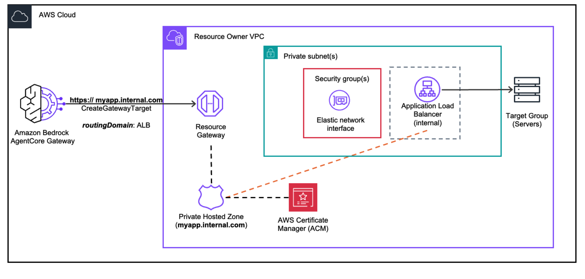

<!-- Copyright Amazon.com, Inc. or its affiliates. All Rights Reserved. -->
<!-- SPDX-License-Identifier: Apache-2.0 -->

# Advanced Concepts

This section covers private DNS, private certificates, and the patterns needed to make them work with AgentCore Gateway VPC egress.


## Private DNS: Routing Domain

Amazon VPC Lattice requires that the domain used in a resource configuration be publicly resolvable. If your private endpoint uses a domain that is only resolvable within your VPC (for example, a Route 53 private hosted zone), you must use the `routingDomain` field.



### How it works

When using a routing domain:

1. The **target URL** uses the actual private DNS name of your resource (the name resolvable within your VPC)
2. The **`routingDomain`** is a separate, publicly resolvable domain that AgentCore uses only to set up the VPC Lattice resource configuration
3. At invocation time, AgentCore routes traffic through the routing domain but sends requests with the private DNS name as the **TLS SNI hostname**, so your resource receives requests addressed to its actual private domain


### Common routing domain options

The routing domain can be any publicly resolvable domain that routes to your private resource within the VPC:

| Option | Routing Domain | Target URL |
|--------|---------------|------------|
| **Internal ALB** | `internal-<name>-<id>.us-west-2.elb.amazonaws.com` | Private DNS name of the resource behind the ALB |
| **Internal NLB** | `internal-<name>-<id>.us-west-2.elb.amazonaws.com` | Private DNS name of the resource behind the NLB |
| **VPC Endpoint (VPCE)** | `<vpce-id>.execute-api.<region>.vpce.amazonaws.com` | Private API Gateway hostname (e.g., `https://<api-id>.execute-api.<region>.amazonaws.com`) |

### Traffic flow with routing domain

```
1. AgentCore resolves the VPC Lattice-generated DNS name to reach the resource gateway
2. Traffic enters your VPC through the resource gateway, addressed to the routing domain
3. The routing domain (ALB/NLB/VPCE) forwards the request to your private resource
4. The TLS SNI header contains the actual target domain, so your resource receives
   the request with the correct hostname
```

> **Note:** The `routingDomain` field is only available for the `managedLatticeResource` option. For self-managed Lattice, configure the routing domain directly in your resource configuration when you create it.

## Private Certificates: ALB Workaround

VPC egress requires your target endpoint to have a **publicly trusted TLS certificate**. If your private resource uses a certificate issued by a private certificate authority (CA), the recommended workaround is to place an internal Application Load Balancer (ALB) in front of your resource.

### How it works

```
AgentCore Gateway
  → VPC Lattice (routingDomain: ALB DNS)
    → Resource Gateway ENIs
      → Internal ALB (public cert, TLS termination + host header transform)
        → Your resource (private cert, HTTPS)
```

1. The **target URL** uses a domain that matches your public ACM certificate (e.g., `https://my-server.my-company.com`)
2. The **`routingDomain`** is the internal ALB DNS name
3. VPC Lattice routes traffic to the ALB via the routing domain. The TLS SNI is set to `my-server.my-company.com`, which matches the ALB's public ACM certificate, so the TLS handshake succeeds
4. The ALB **terminates TLS** and applies a **host header transform** to rewrite the Host header from the public domain to the private resource's domain (e.g., `my-server.my-company.internal`)
5. The ALB forwards the request to your backend resource over HTTPS using the private certificate. All traffic stays inside your VPC


For domain and certificate setup guides, see the [Prerequisites](../00-prerequisites/) folder.

## Labs

| Notebook | Description |
|----------|-------------|
| [01-private-domain.ipynb](./01-private-domain.ipynb) | Use a private hosted zone with `routingDomain` and a public certificate. |
| 02-private-certificate-authority.ipynb (coming soon) | Set up AWS Private CA and use the ALB workaround for private certificates. |
| 03-self-signed-certificate.ipynb (coming soon) | Use the ALB workaround for self-signed certificates (no Private CA cost). |
| 04-private-domain-and-certificate.ipynb (coming soon) | Combine private DNS and private certificates with the ALB workaround pattern. |

## License

This project is licensed under the Apache License 2.0. See the [LICENSE](../LICENSE.txt) file for details.
