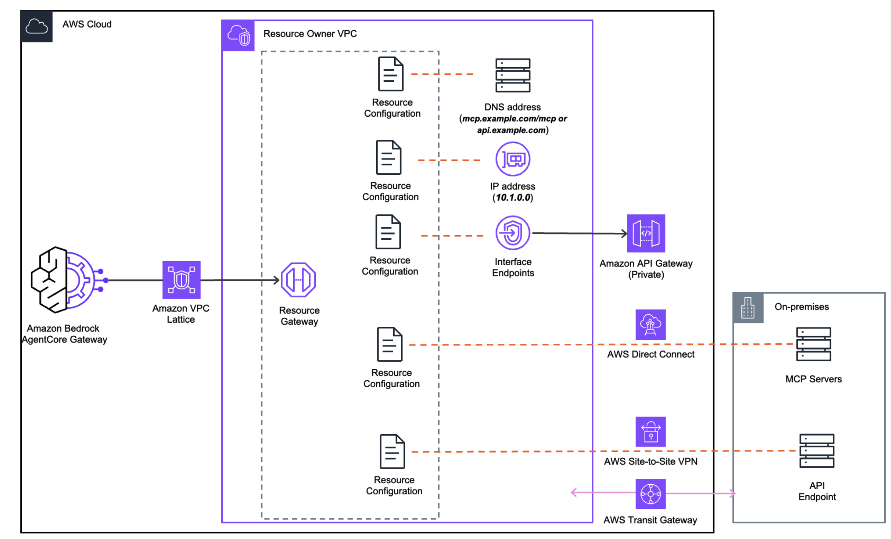

<!-- Copyright Amazon.com, Inc. or its affiliates. All Rights Reserved. -->
<!-- SPDX-License-Identifier: Apache-2.0 -->

# Configure Amazon Bedrock AgentCore Gateway VPC Egress for Gateway Targets using VPC Lattice

> This feature is made available to you as a "Beta Service" as defined in the [AWS Service Terms](https://aws.amazon.com/service-terms/). It is subject to your Agreement with AWS and the AWS Service Terms.

Learn about connecting [private resources in your VPC using Amazon VPC Lattice](https://docs.aws.amazon.com/bedrock-agentcore/latest/devguide/vpc-egress-private-endpoints.html) and [configuring Amazon Bedrock AgentCore Gateway VPC Egress for Gateway Targets](https://docs.aws.amazon.com/bedrock-agentcore/latest/devguide/gateway-vpc-egress.html).

Amazon Bedrock AgentCore supports private connectivity to resources hosted inside your AWS VPC or on-premises environments connected to your VPC, such as private MCP servers, and internal REST APIs, without exposing those services to the public internet.

Private connectivity is established using [Amazon VPC Lattice](https://docs.aws.amazon.com/vpc-lattice/latest/ug/what-is-vpc-lattice.html) resource gateways and resource configurations. Two modes are supported for configuring this connectivity:

- Managed Lattice - Amazon Bedrock AgentCore creates and manages the VPC Lattice resource gateway and resource configuration in your account on your behalf, using a service-linked role.

- Self-managed Lattice - You create the VPC Lattice resource gateway and resource configuration yourself, then provide the resource configuration identifier to AgentCore. Use this option for cross-account connectivity, if you already have VPC Lattice resources set up, or if you need fine-grained control over the Lattice configuration.

## Key Terms

- Resource VPC: The [Amazon VPC](https://docs.aws.amazon.com/vpc/latest/userguide/what-is-amazon-vpc.html) where your private resource lives, for example, the VPC containing your privately hosted MCP server or API endpoint. This is the VPC that AgentCore Gateway needs to reach. 

- Gateway account: The AWS account that owns Amazon Bedrock AgentCore Gateway. Resource VPC can either be in the same AWS account as Gateway account or be in a different account.

- Resource Gateway: [ Resource gateway in VPC Lattice](https://docs.aws.amazon.com/vpc/latest/privatelink/resource-gateway.html) acts as the private entry point into your Resource VPC. When created, it provisions one Elastic Network Interface (ENI) per subnet you specify, each sitting inside your VPC. All traffic from AgentCore Gateway to your private resource arrives through these ENIs.

- Resource Configuration: [Resource configuration for VPC resources](https://docs.aws.amazon.com/vpc/latest/privatelink/resource-configuration.html) defines the specific resource AgentCore Gateway is allowed to reach through the Resource Gateway, identified by a domain name, IP address, or AWS ARN. Rather than granting access to your entire VPC, a Resource Configuration scopes connectivity to a single endpoint. 

- Service Network Resource Association: A [service network resource association](https://docs.aws.amazon.com/vpc-lattice/latest/ug/service-network-associations.html) connects a resource configuration to the AgentCore service network, enabling the AgentCore service to invoke your private endpoint. AgentCore always creates and manages this association on your behalf, regardless of whether you use managed or self-managed Lattice.

- Routing domain: An optional field that specifies an intermediate publicly resolvable domain that AgentCore uses as the resource configuration domain instead of the actual target domain. This is required when your private endpoint uses a domain that is not publicly resolvable, because Amazon VPC Lattice requires publicly resolvable DNS for resource configurations. The AgentCore service continues to invoke the actual target domain using SNI override.

## Labs

> **Note:** In these labs, AgentCore Gateway is configured with **Cognito for inbound authentication** and **no authorization between the AgentCore Gateway and targets**. This is done to keep the focus on VPC connectivity patterns. For production workloads, you can configure any OAuth 2.0 compliant identity provider for inbound authentication (e.g., Entra ID, Auth0, Okta): see [Identity provider setup](https://docs.aws.amazon.com/bedrock-agentcore/latest/devguide/identity-idps.html). For outbound authorization between AgentCore Gateway and your targets, we recommend setting up [AgentCore Gateway Identity credential management](https://docs.aws.amazon.com/bedrock-agentcore/latest/devguide/gateway-identity.html).

### Cost Warnings

| Resource | Cost | Labs |
|----------|------|------|
| **AWS Private CA** (short-lived mode) | $50/month | 02-private-certificate-authority |
| **Internal ALB** | ~$0.0225/hour + LCU charges | All labs |
| **EC2 instance** (t3.micro) | ~$0.0104/hour | All labs |
| **NAT Gateway** | ~$0.045/hour + data processing | All labs (via VPC stack) |

Make sure to run the **Cleanup** section in each notebook after completing the lab to avoid ongoing charges.

| Lab | Folder | Description |
|-----|--------|-------------|
| **Prerequisites** | [`00-prerequisites/`](./00-prerequisites/) | Deploy VPCs across accounts and regions, bootstrap CDK, and set up the shared AgentCore Gateway with Cognito M2M authentication. All subsequent labs depend on this. |
| **Managed Lattice** | [`01-managed-lattice/`](./01-managed-lattice/) | Getting started with AgentCore-managed VPC Lattice. AgentCore automatically creates the Resource Gateway, Resource Configuration, and service network association. Includes a VPC peering example. |
| **Self-Managed Lattice** | [`02-self-managed-lattice/`](./02-self-managed-lattice/) | Create and manage VPC Lattice Resource Gateways and Resource Configurations yourself. Includes cross-account connectivity via AWS Resource Access Manager (RAM). |
| **Advanced Concepts**  | [`03-advanced-concepts/`](./03-advanced-concepts/) | Explores private domains (Route 53 private hosted zones), private certificates (AWS Private CA), and combinations of both with AgentCore Gateway VPC egress. |
| **ECS Deployment** (coming soon) | `04-ecs-deployment/` | Deploy MCP servers on Amazon ECS Fargate behind an internal ALB with TLS termination, then connect to AgentCore Gateway using managed VPC Lattice. |
| **EKS Deployment** (coming soon) | `05-eks-deployment/` | Deploy MCP servers and REST APIs on Amazon EKS behind an internal NLB with TLS termination, using private hosted zones and `routingDomain` for private DNS patterns. |

### Regions and accounts

These labs are tested in **us-west-2** (primary region). Ensure AgentCore Gateway and its features are available in your region: see [AgentCore supported regions](https://docs.aws.amazon.com/bedrock-agentcore/latest/devguide/agentcore-regions.html). The following labs require additional setup:

- VPC Peering lab (coming soon): requires a VPC in **us-east-1** (deployed in Lab 0, Step 5)
- Cross-Account lab (coming soon): requires a **second AWS account** with a VPC in us-west-2 (deployed in Lab 0, Step 7)

### Prerequisites for all labs

- **AWS CLI** v2 — [Installation guide](https://docs.aws.amazon.com/cli/latest/userguide/getting-started-install.html)
- **Node.js** v18+ and **npm** — [Download](https://nodejs.org/en/download)
- **AWS CDK CLI** — [Getting started](https://docs.aws.amazon.com/cdk/v2/guide/getting-started.html)
- **Docker** — [Install Docker](https://docs.docker.com/engine/install/)
- **Python 3.12+** — For running Jupyter notebooks
- **IAM permissions** — Your IAM identity needs permissions for Amazon Bedrock AgentCore, Amazon VPC Lattice, Amazon EC2, and AWS CloudFormation. See the [IAM permissions guide](https://docs.aws.amazon.com/bedrock-agentcore/latest/devguide/security-iam.html) for details.
- Make sure you have correct IAM permissions for [AgentCore Gateway - Amazon VPC Lattice](https://docs.aws.amazon.com/bedrock-agentcore/latest/devguide/vpc-egress-private-endpoints.html)

### Domain and certificate requirements

Labs that deploy private resources behind load balancers (ECS, EKS) require:
- A **domain name** you own with a Route 53 hosted zone (can be in any AWS account)
- An **ACM public certificate** for that domain

See the [Prerequisites](./00-prerequisites/) folder for domain and certificate setup guides covering public domains, private domains, and `routingDomain` patterns.

## License

This project is licensed under the Apache License 2.0. See the [LICENSE](LICENSE.txt) file for details.
