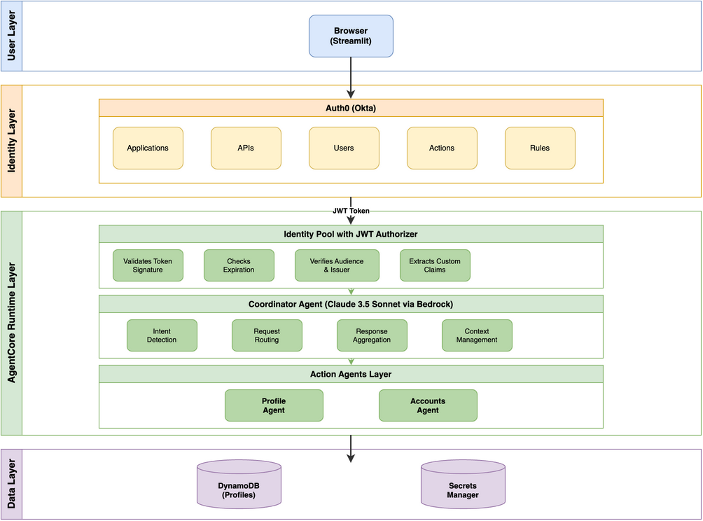

# Identity-Aware Multi-Agent Financial Assistant

A reference implementation demonstrating **RFC 8693 Token Exchange** in a multi-agent system on AWS Bedrock AgentCore Runtime. The coordinator agent does not forward the user's JWT — it exchanges it for attenuated, least-privilege tokens before invoking each sub-agent. Auth0 provides the OAuth 2.0/OIDC identity layer.

## Overview

This sample demonstrates how to build a production-ready multi-agent system with proper identity management using AWS Bedrock AgentCore. Rather than forwarding the user's JWT to sub-agents (which leaks full privileges), the coordinator performs **RFC 8693 token exchange** to mint attenuated tokens scoped to each sub-agent's needs before invocation.

### Use Case Details

| Information | Details |
|-------------|---------|
| Use case type | Conversational |
| Agent type | Multi-agent (Supervisor/Coordinator pattern) |
| Use case components | Tools, Multi-agent routing, OAuth 2.0 PKCE, RFC 8693 Token Exchange, Observability |
| Use case vertical | Financial Services |
| Example complexity | Advanced |
| SDK used | Amazon Bedrock AgentCore SDK, Strands Agents, boto3 |

### Architecture



The system implements a **supervisor pattern** where:

1. **Streamlit Client** - Web UI with OAuth 2.0 PKCE login flow
2. **Auth0 IdP** - Issues JWT tokens with custom claims (customer_id, account_types, roles)
3. **AgentCore Runtime** - Validates JWT via `customJWTAuthorizer`
4. **Coordinator Agent** - Exchanges user JWT for attenuated tokens (RFC 8693) before routing to sub-agents; scope-gates tools based on user permissions
5. **Action Agents** - Profile, Accounts - each validates exchanged token scopes independently

```
                              +------------------+
                              |   Auth0     |
                              |      (IdP)       |
                              +--------+---------+
                                       | JWT Issued
                                       v
+---------------------+        +---------------+
|  Streamlit Client   |<-------|     User      |
|  (OAuth 2.0 + PKCE) |        +---------------+
+----------+----------+
           | HTTP + Authorization: Bearer {jwt}
           v
+---------------------+
|  AgentCore Runtime  |
|  +---------------+  |
|  |JWT Authorizer |  |<--- Validates against IdP JWKS
|  +-------+-------+  |
|          v          |
|  +---------------+  |
|  |  Coordinator  |  |
|  | (scope-gates  |  |
|  |  tools + does  |  |
|  |  token exchange)|  |
|  +-------+-------+  |
+----------+----------+
           | RFC 8693 Token Exchange: attenuated scopes per agent
           +---------------+
           v               v
       +-------+       +-------+
       |Profile|       |Accts  |
       |Agent  |       |Agent  |
       +-------+       +-------+
    Each agent receives only the scopes it needs
```

**Key Pattern: RFC 8693 token exchange with scope attenuation -- coordinator exchanges user JWT for per-agent tokens with least-privilege scopes**

### Key Features

- **3-Legged OAuth (PKCE)** - Secure authorization code flow for web applications
- **JWT Custom Claims** - User context (customer_id, account_types, kyc_status, roles) embedded in tokens
- **RFC 8693 Token Exchange** - Coordinator exchanges user JWT for attenuated tokens with per-agent scope policies
- **Scope-Gated Tools** - Users without accounts scopes don't see the accounts tool; permission check before token exchange as safety net
- **Fine-Grained Scopes** - 13 scopes (profile:personal:*, profile:preferences:*, accounts:savings:*, accounts:transaction:read, accounts:credit:*, accounts:investment:read)
- **Per-Agent Authorization** - Each agent validates exchanged token scopes and user can only access their own resources
- **AWS Secrets Manager** - Production-ready credential storage with caching
- **OpenTelemetry Observability** - GenAI-specific tracing via AWS OpenTelemetry distro
- **Dual-Issuer Validation** - Sub-agents accept tokens from Auth0 (direct) or the token exchange service (via coordinator)
- **requestHeaderAllowlist** - Authorization header access enabled via AgentCore configuration
- **Educational UI** - JWT viewer, API call log, auth state machine visualization

## Prerequisites

### Required Software

- Python 3.10+
- AWS CLI v2
- Docker (for container builds)
- Git

### AWS Account Requirements

- AWS Account with Bedrock AgentCore access
- Region: `us-east-1` — or set `AWS_REGION` to your preferred region
- Bedrock model access enabled (Claude Sonnet recommended)

### Required AWS Services

- Amazon Bedrock AgentCore Runtime
- Amazon ECR (Elastic Container Registry)
- AWS Secrets Manager
- Amazon CloudWatch (for observability)

### Auth0 Requirements

- Auth0 tenant (free tier works)
- Application configured for OAuth 2.0 + PKCE
- API (Resource Server) with custom scopes
- Post-login Action for custom claims

### IAM Permissions

Your AWS credentials need permissions to:

```json
{
    "Version": "2012-10-17",
    "Statement": [
        {
            "Effect": "Allow",
            "Action": [
                "bedrock-agentcore:*",
                "ecr:*",
                "iam:CreateRole",
                "iam:AttachRolePolicy",
                "iam:PassRole",
                "iam:GetRole",
                "secretsmanager:GetSecretValue",
                "secretsmanager:CreateSecret",
                "logs:*"
            ],
            "Resource": "*"
        }
    ]
}
```

## Use Case Setup

### 1. Clone and Configure Environment

```bash
# Clone repository
git clone https://github.com/awslabs/amazon-bedrock-agentcore-samples.git
cd amazon-bedrock-agentcore-samples/02-use-cases/auth0-multi-agent-obo

# Create virtual environment
python3 -m venv venv
source venv/bin/activate  # On Windows: venv\Scripts\activate

# Install dependencies
pip install -r requirements.txt

# Configure environment
cp .env.example .env
```

### 2. Configure Auth0

Edit `.env` with your identity provider settings:

```bash
# Auth0 Configuration
AUTH0_DOMAIN=your-tenant.auth0.com
AUTH0_CLIENT_ID=your_client_id
AUTH0_CLIENT_SECRET=your_client_secret
AUTH0_AUDIENCE=https://agentcore-financial-api
AUTH0_CALLBACK_URL=http://localhost:9090/callback
```

Create an Auth0 Post-Login Action to add custom claims:

```javascript
exports.onExecutePostLogin = async (event, api) => {
  const namespace = 'https://agentcore.example.com/';

  // Add custom claims for authorization
  api.accessToken.setCustomClaim(namespace + 'customer_id', 'CUST-001');
  api.accessToken.setCustomClaim(namespace + 'account_types', ['savings', 'checking']);
  api.accessToken.setCustomClaim(namespace + 'kyc_status', 'verified');
  api.accessToken.setCustomClaim(namespace + 'roles', ['customer']);

  // CRITICAL: AgentCore requires client_id claim
  api.accessToken.setCustomClaim('client_id', event.client.client_id);
};
```

See [docs/auth0_configuration.md](docs/auth0_configuration.md) for detailed setup.

### 3. Deploy Agents

**Option 1: Automated Shell Script (Recommended)**

```bash
# Deploy all agents to AgentCore
./deploy_all.sh
```

**Option 2: CDK Deployment**

```bash
cd infrastructure/cdk
pip install -r requirements.txt
cdk deploy
```

See [infrastructure/cdk/README.md](infrastructure/cdk/README.md) for full CDK setup and configuration.

**Option 3: Manual Step-by-Step**

```bash
# 1. Build and push container images
cd agents/coordinator
docker build -t coordinator-agent .
# Push to ECR...

# 2. Create AgentCore runtime for each agent
aws bedrock-agentcore-control create-agent-runtime \
    --agent-runtime-name "coordinator-agent" \
    --container-configuration "..." \
    --authorizer-configuration "customJWTAuthorizer={...}"

# 3. Update with header allowlist (required for JWT access)
aws bedrock-agentcore-control update-agent-runtime \
    --agent-runtime-id "$AGENT_ID" \
    --request-header-configuration 'requestHeaderAllowlist=["Authorization"]'
```

### 4. Verify Deployment

```bash
# Run post-deployment diagnostics
./debug.sh status
```

## Execution Instructions

### Run the Streamlit Application

```bash
cd client/streamlit_app
streamlit run app.py
```

Open browser to: `http://localhost:8501`

### Sample Interactions

After logging in with Auth0:

**Profile Query:**
```
User: What is my customer profile?
Agent: Based on your profile, you are customer CUST-001 with verified KYC status...
```

**Account Query:**
```
User: What are my account balances?
Agent: You have 2 accounts: Savings ($5,234.50), Checking ($1,892.33)...
```

### Run Tests

```bash
# All unit tests
pytest tests/unit/ -v

# Specific test module
pytest tests/unit/test_token_exchange.py -v
```

## Configuration

### Environment Variables Reference

| Variable | Description | Required |
|----------|-------------|----------|
| `AUTH0_DOMAIN` | Auth0 tenant domain | Yes |
| `AUTH0_CLIENT_ID` | Auth0 application client ID | Yes |
| `AUTH0_CLIENT_SECRET` | Auth0 client secret | Yes |
| `AUTH0_AUDIENCE` | API identifier (audience) | Yes |
| `AUTH0_CALLBACK_URL` | OAuth callback URL | Yes |
| `AWS_REGION` | AWS region for AgentCore | Yes |
| `COORDINATOR_AGENT_ID` | Coordinator agent runtime ID | Yes |
| `PROFILE_AGENT_ID` | Profile agent runtime ID | Yes |
| `ACCOUNTS_AGENT_ID` | Accounts agent runtime ID | Yes |
| `USE_SECRETS_MANAGER` | Use AWS Secrets Manager (true/false) | No |
| `LOG_LEVEL` | Logging level (DEBUG/INFO/WARNING) | No |

### Custom JWT Claims Namespace

The sample uses the namespace `https://agentcore.example.com/` for custom claims:

```json
{
  "https://agentcore.example.com/customer_id": "CUST-001",
  "https://agentcore.example.com/account_types": ["savings", "checking"],
  "https://agentcore.example.com/kyc_status": "verified",
  "https://agentcore.example.com/security_level": "standard",
  "https://agentcore.example.com/roles": ["customer"]
}
```

## Project Structure

```
identity-aware-multi-agent-financial-assistant/
├── agents/                          # Agent implementations
│   ├── coordinator/                 # Coordinator (orchestrator) agent
│   │   ├── main.py                 # Entry point with JWT extraction
│   │   ├── agent.py                # Strands agent definition
│   │   ├── subagent_router.py      # Routes to sub-agents with RFC 8693 exchanged tokens
│   │   ├── auth_context.py         # Authentication context handling
│   │   ├── tools/                  # Agent tools
│   │   ├── shared/                 # Shared modules (http client, auth)
│   │   ├── Dockerfile              # Container definition
│   │   └── requirements.txt        # Python dependencies
│   ├── customer_profile/           # Profile management agent
│   └── accounts/                   # Account information agent
├── client/                         # Client applications
│   └── streamlit_app/             # Streamlit web UI
│       ├── app.py                 # Main application
│       ├── auth0_handler.py       # OAuth 2.0 PKCE flow
│       ├── agentcore_client.py    # HTTP client to AgentCore
│       └── components/            # UI components (JWT viewer, etc.)
├── shared/                        # Shared library modules
│   ├── auth/                      # JWT validation, claims extraction
│   ├── config/                    # Settings, secrets provider
│   ├── models/                    # Data models
│   └── http/                      # HTTP client for agent communication
├── infrastructure/                # Infrastructure configuration
│   ├── auth0/                     # Auth0 Actions and configuration
│   └── cdk/                       # AWS CDK stack (alternative deployment)
├── tests/                         # Test suite
│   └── unit/                      # Unit tests
├── docs/                          # Documentation
│   ├── architecture.md            # Detailed architecture
│   ├── auth0_configuration.md     # Auth0 setup guide
│   └── diagrams/                  # Architecture diagrams
├── images/                        # Architecture images for README
├── .env.example                   # Environment template
├── requirements.txt               # Root dependencies
├── deploy_all.sh                  # Automated deployment
├── cleanup_all.sh                 # Automated cleanup
├── debug.sh                       # Read-only diagnostic commands
└── README.md                      # This file
```

## Troubleshooting

### Authentication Issues

**401 Unauthorized - client_id mismatch**
```bash
# Verify JWT has client_id claim
# Decode your token at jwt.io and check for:
# - "client_id": "your_client_id"
# - Must match AUTH0_CLIENT_ID in AgentCore authorizer config
```

**Token validation fails**
```bash
# Check JWKS endpoint is accessible
curl https://your-tenant.auth0.com/.well-known/jwks.json

# Check OIDC discovery
curl https://your-tenant.auth0.com/.well-known/openid-configuration
```

### Agent Issues

**Agent not found (404)**
```bash
# Verify agent is deployed and running
aws bedrock-agentcore-control list-agent-runtimes --region $AWS_REGION

# Check agent status
aws bedrock-agentcore-control get-agent-runtime \
    --agent-runtime-id "your-agent-id" \
    --region $AWS_REGION
```

**Sub-agent invocation fails**
```bash
# Verify EXPECTED_AWS_ACCOUNT is set in coordinator container
# This is required for constructing sub-agent ARNs

# Check CloudWatch logs
aws logs tail /aws/bedrock-agentcore/coordinator-agent --follow
```

### Debug Commands

Use the included diagnostic script for read-only AWS inspection:

```bash
./debug.sh status              # Show status of all 3 agent runtimes
./debug.sh logs coordinator 10 # Tail coordinator logs (last 10 minutes)
./debug.sh logs profile 5      # Tail profile agent logs
./debug.sh env coordinator     # Show runtime environment variables
./debug.sh traces 5            # Show recent trace spans
./debug.sh all                 # Run all status checks
```

Other useful commands:

```bash
# Run local tests
pytest tests/unit/ -v --tb=short

# Run with debug logging
LOG_LEVEL=DEBUG python3 -m streamlit run client/streamlit_app/app.py
```

## Clean Up Instructions

**Automated Cleanup:**

```bash
./cleanup_all.sh
```

**Manual Cleanup:**

```bash
# 1. Delete agent runtimes
aws bedrock-agentcore-control delete-agent-runtime \
    --agent-runtime-id "$COORDINATOR_AGENT_ID" \
    --region $AWS_REGION

# Repeat for each agent...

# 2. Delete ECR repositories
aws ecr delete-repository \
    --repository-name coordinator-agent \
    --force \
    --region $AWS_REGION

# 3. Delete IAM roles (optional)
aws iam delete-role --role-name AgentCoreCoordinatorRole

# 4. Delete secrets (optional)
aws secretsmanager delete-secret \
    --secret-id agentcore/auth0 \
    --force-delete-without-recovery
```

## Additional Resources

- [AWS Bedrock AgentCore Documentation](https://docs.aws.amazon.com/bedrock-agentcore/latest/devguide/)
- [AgentCore OAuth Configuration](https://docs.aws.amazon.com/bedrock-agentcore/latest/devguide/runtime-oauth.html)
- [AgentCore Identity Provider Setup](https://docs.aws.amazon.com/bedrock-agentcore/latest/devguide/identity-idp-okta.html)
- [Auth0 Documentation](https://auth0.com/docs)
- [OAuth 2.0 PKCE Specification](https://oauth.net/2/pkce/)
- [Strands Agents Framework](https://github.com/strands-ai/strands-agents)

## Disclaimer

The examples provided in this repository are for experimental and educational purposes only. They demonstrate concepts and techniques but are not intended for direct use in production environments without proper security review.

**Security Considerations:**
- Never commit secrets to version control
- Always use AWS Secrets Manager for production credentials
- Enable HTTPS for all production deployments
- Implement proper rate limiting and monitoring
- Review and customize authorization rules for your use case

Make sure to have [Amazon Bedrock Guardrails](https://docs.aws.amazon.com/bedrock/latest/userguide/guardrails.html) in place to protect against [prompt injection](https://docs.aws.amazon.com/bedrock/latest/userguide/prompt-injection.html).

---

**Built for the AWS Bedrock AgentCore community**
